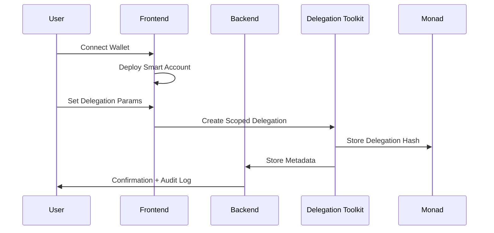
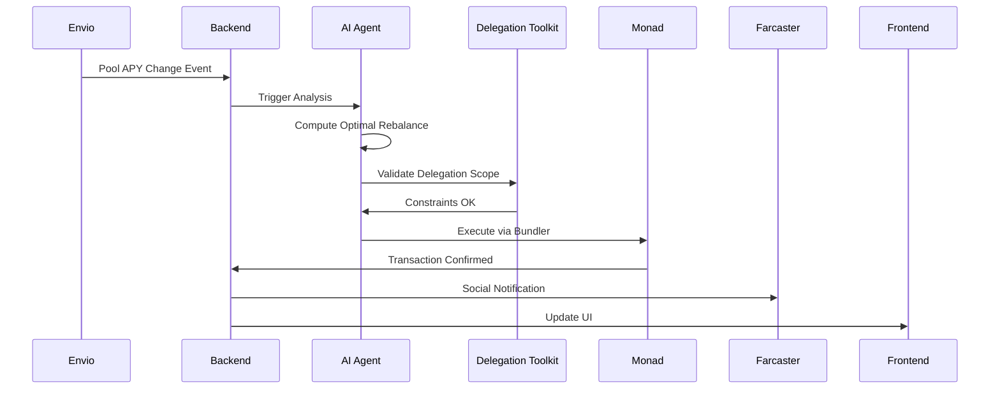

# AI Yield Agent - Stacking Bounties Strategy 🏆

An intelligent DeFi yield optimization agent that maximizes prize eligibility by integrating multiple bounty categories.

## 🎯 Bounty Stack
- **Main Track**: AI Agent / Automation / Consumer App
- **Delegations**: Most Innovative Use of Delegation Toolkit
- **Envio**: HyperIndex/HyperSync integration for real-time indexing
- **Bonus**: Farcaster Mini App for social notifications

## 🏗️ Architecture

```
┌─────────────────┐    ┌─────────────────┐    ┌─────────────────┐
│   Frontend      │    │    Backend      │    │   AI Agent     │
│   (Next.js)     │◄──►│  (Node.js)      │◄──►│  (Python)       │
│                 │    │                 │    │                 │
│ • Wallet Connect│    │ • Delegation DB │    │ • APY Analysis  │
│ • Delegation UI │    │ • Audit Logs    │    │ • Rebalance AI  │
│ • History View  │    │ • Webhooks      │    │ • Risk Scoring  │
└─────────────────┘    └─────────────────┘    └─────────────────┘
         │                       │                       │
         │              ┌─────────────────┐              │
         │              │     Envio       │              │
         └──────────────►│   HyperSync     │◄─────────────┘
                        │                 │
                        │ • Pool Events   │
                        │ • APY Triggers  │
                        │ • Notifications │
                        └─────────────────┘
                                 │
                        ┌─────────────────┐
                        │ Monad Testnet   │
                        │                 │
                        │ • Smart Accounts│
                        │ • Delegations   │
                        │ • Pool Contracts│
                        └─────────────────┘
```

## 🔄 Sequence Diagrams

### Delegation Setup Flow


### AI Execution Flow


## 🛠️ Tech Stack

- **Frontend**: Next.js, Wagmi, MetaMask SDK
- **Backend**: Node.js (Fastify), PostgreSQL
- **AI Agent**: Python, scikit-learn
- **Smart Accounts**: MetaMask Smart Accounts
- **Delegations**: Delegation Toolkit
- **Indexing**: Envio HyperSync/HyperIndex
- **Blockchain**: Monad Testnet
- **Social**: Farcaster Mini App

## 🚀 Quick Start

```bash
# Install dependencies
npm install

# Setup environment
cp .env.example .env

# Start services
docker-compose up -d

# Run frontend
cd frontend && npm run dev

# Run backend
cd backend && npm start

# Run AI agent
cd agent && python main.py
```

## 🔒 Security Features

- ✅ Scoped delegations with expiry
- ✅ Amount limits and nonce validation
- ✅ Full audit trail in PostgreSQL
- ✅ AI confidence thresholds
- ✅ Manual approval fallbacks

## 📊 Demo Scenarios

1. **Delegation Setup**: User creates scoped delegation for yield optimization
2. **Event Trigger**: Envio detects APY change in monitored pools
3. **AI Decision**: Agent analyzes and recommends rebalance
4. **Execution**: Delegated transaction executed on Monad
5. **Notification**: User notified via app + Farcaster

## 🏆 Hackathon Compliance

### ✅ Best AI Agent Track
- **AI Decision Engine**: ML-based yield optimization with confidence scoring
- **Delegated Execution**: Agent acts autonomously within user-defined constraints  
- **MetaMask Smart Accounts**: Seamless permissions and gasless transactions
- **Monad Integration**: Full deployment on Monad testnet

### ✅ Most Innovative Use of Delegations
- **Scoped Permissions**: Granular constraints (pools, amounts, expiry)
- **AI-Driven Automation**: First delegated AI yield optimization
- **Constraint Validation**: Pre-execution validation of all limits
- **Audit Transparency**: Complete logging of delegated actions

### ✅ Envio Integration
- **HyperSync Monitoring**: Real-time pool event indexing
- **GraphQL Queries**: Rich pool data via Envio APIs
- **Event-Driven Triggers**: Webhook-based AI activation
- **Data Pipeline**: Envio → Backend → AI Agent workflow

## 📁 Project Structure

```
ai-yield-agent/
├── frontend/          # Next.js app
├── backend/           # Node.js API
├── agent/             # Python AI service
├── infra/             # Docker & deployment
└── docs/              # Documentation
```